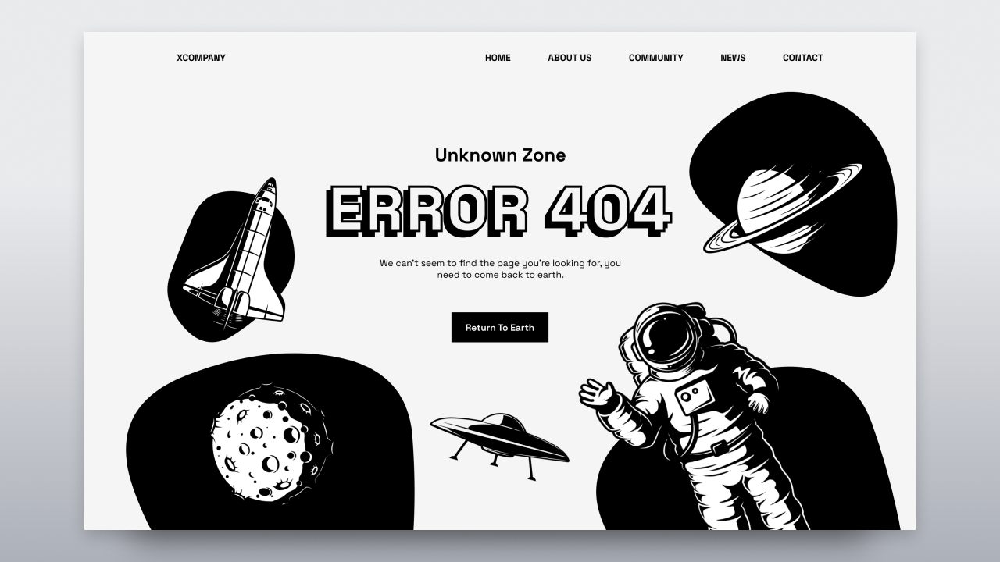

# Responsive Portfolio Website 1

- Responsive Portfolio Website Using HTML CSS And JavaScript
- Contains animations when scrolling.
- Smooth scrolling in each section.
- Contains a beautiful dark theme.
- The color of the project can be customized.
- Sending emails in the contact section.
- Developed first with the Mobile First methodology, then for desktop.
- Compatible with all mobile devices and with a beautiful and pleasant user interface.

💙 Go to my website to see more projects like this [jhonysouza100.site](https://jhonysouza100.site) 💙



Download more vector logos [Worldvectorlogo.com](https://worldvectorlogo.com)

Setting up an email-sending system often requires a backend server [EmailJs.com](https://dashboard.emailjs.com/admin)

```
========== CREATE A TEMPLATE ==========

Subject *
New message from {{user_name}}

Content *
Names: {{user_name}}

Email: {{user_email}}

Message: {{user_message}}

Best wishes,
EmailJS team
```

## 📦 Vanilla HTML Deployment with Docker & Nginx
Este repositorio contiene un ejemplo simple de cómo desplegar un sitio web estático construido con HTML puro (vanilla HTML) utilizando Docker y Nginx como servidor web.

### 🚀 Características:

- Sitio web estático con HTML puro

- Configuración ligera y lista para producción

- Dockerfile para contenerizar la aplicación

- Configuración personalizada de Nginx

- Instrucciones para levantar el contenedor

### 🛠️ Tecnologías utilizadas:

- HTML5

- Docker

- Nginx

### Comandos

#### Construir una imagen
```cmd
docker build . -t [a-image-name]:[a-image-version]
```

#### Levantar un contenedor desde la imagen

```cmd
docker run -p [a-port]:80 [image-name]:[image-version]
```

---

> Nota: El puerto por defecto de Nginx es el puerto: 80